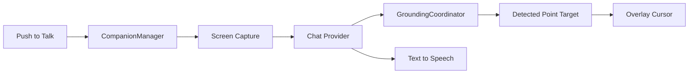
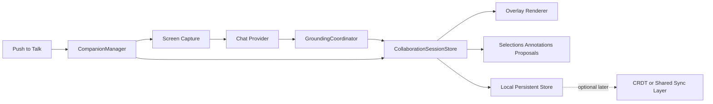
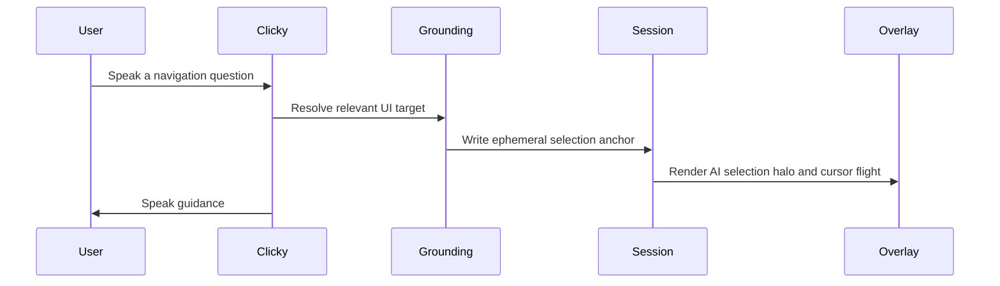
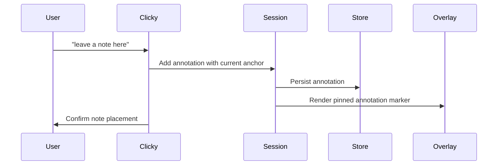
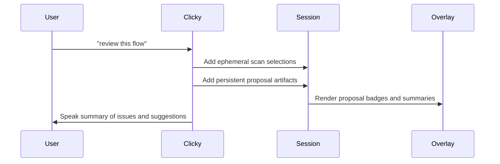
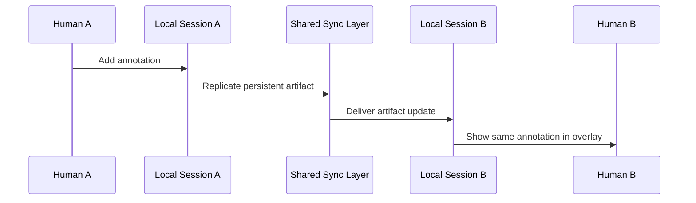

# Collaborative UI Architecture Plan

## Purpose

This document describes how Clicky can evolve from a voice-guided UI companion into a collaborative UI workflow where the human and AI share selection, annotations, and proposed edits on top of a live interface.

The key design choice is to treat the target UI as an observed world and maintain a separate shared collaboration session layered on top of it. That session becomes the thing both the human and AI can read and write.

## Product Direction

Clicky already has strong primitives for ephemeral guidance:

- push-to-talk input
- screen capture across monitors
- AI response generation
- grounding to UI elements
- an overlay cursor that points at relevant elements

The next step is not to turn the entire external UI into a CRDT. Instead, it is to add a shared collaboration document about the UI.

That collaboration document should store:

- the current shared selection
- pinned annotations
- proposed changes
- review decisions such as accept and reject
- lightweight presence for both the human and AI

## Design Principles

- Keep the current voice-to-guidance loop intact.
- Separate ephemeral guidance from persistent collaboration state.
- Prefer semantic anchors over raw coordinates.
- Keep grounding local-first because the useful permissions and context live on the device.
- Add CRDT sync only after the artifact model is stable and worth sharing across devices or users.

## Current Clicky Architecture

Today the system is optimized for one-shot guidance.



### Current Strengths

- `CompanionManager` already orchestrates the full loop from transcript to grounding.
- `GroundingCoordinator` already abstracts multiple grounding providers.
- The native automation provider already produces accessibility metadata that can become semantic anchors.
- The overlay already acts like AI presence on screen.

### Current Limitation

The collaboration state is effectively single-slot and ephemeral:

- one detected target
- one navigation animation
- one transient bubble
- one conversation history

This works well for guidance but not for shared review workflows.

## Target Architecture

The target model introduces a local collaboration session between the current grounding layer and the overlay.



## Core Layers

### 1. Observed UI Layer

This is the external app UI that Clicky does not own.

Inputs into this layer include:

- accessibility snapshots
- screenshots
- cursor position
- frontmost application context

This layer is volatile. Elements can move, disappear, or become stale at any time.

### 2. Anchor Resolution Layer

This is the main generalization of the existing grounding system.

Instead of collapsing every grounding result into a single point, Clicky should resolve a `UIAnchor` that preserves as much semantic identity as possible.

Suggested priority order:

1. accessibility anchor
2. image-region anchor
3. point fallback anchor

Suggested shape:

```swift
enum UIAnchor: Codable {
    case accessibility(
        bundleIdentifier: String?,
        appName: String,
        role: String?,
        title: String?,
        identifier: String?,
        frame: CGRect?,
        screenNumber: Int?
    )

    case imageRegion(
        screenNumber: Int,
        normalizedRect: CGRect,
        label: String?,
        fingerprint: String?
    )

    case point(
        screenNumber: Int,
        normalizedPoint: CGPoint
    )
}
```

Why this matters:

- coordinates are enough for pointing
- coordinates are not enough for persistent review
- stored anchors need a best-effort way to re-resolve after the UI shifts

### 3. Collaboration Session Layer

This is the new shared object model.

It should live outside `CompanionManager` so the orchestration loop does not also become the durable state engine.

Suggested responsibilities:

- store ephemeral artifacts
- store persistent artifacts
- resolve anchors into current screen positions
- notify the overlay when artifacts should render
- publish structured operations from both the human and AI

Suggested first operations:

```swift
enum CollaborationOp: Codable {
    case setSelection(id: UUID, actor: String, anchor: UIAnchor, persistent: Bool)
    case addAnnotation(id: UUID, actor: String, anchor: UIAnchor, text: String)
    case proposeChange(id: UUID, actor: String, anchor: UIAnchor?, summary: String)
    case acceptProposal(id: UUID, actor: String)
    case rejectProposal(id: UUID, actor: String)
    case clearEphemeral(actor: String)
}
```

### 4. Overlay Rendering Layer

The overlay should evolve from rendering one buddy state machine into rendering a set of collaboration artifacts.

The buddy remains important, but it becomes one renderer among several.

Renderers to add over time:

- AI cursor presence
- shared selection halo
- pinned annotation markers
- proposal badges
- review status markers

The overlay can stay click-through at first. Creation and editing of artifacts can still happen through voice commands or the panel.

### 5. Persistence and Sync Layer

The first persistence target should be local storage only.

This keeps the design testable without taking on multi-device complexity too early.

Add CRDT sync later when one of these becomes true:

- multiple humans need to see the same session live
- the session needs to survive across devices
- concurrent edits need merge semantics
- asynchronous AI review should continue after the local UI session ends

## Ephemeral vs Persistent State

This distinction is the most important product rule in the whole system.

### Ephemeral Artifacts

- temporary AI pointing
- hover hints
- transient shared selection
- short-lived navigation prompts

These should expire automatically and should usually not be synced.

### Persistent Artifacts

- pinned notes
- review comments
- suggested UI changes
- accepted and rejected decisions

These should be stored durably and can later be synchronized.

## Human and AI as Peers

The collaboration model should treat the human and AI as writers to the same session document.

That means the AI should eventually emit structured collaboration operations, not only spoken text plus a coordinate tag.

Suggested actor IDs:

- `human:manik`
- `ai:clicky`
- `ai:oracle`

This makes it possible to show authorship and review history clearly.

## Key Flows

### Flow 1: Voice Guidance With Shared Selection



This is the closest extension of the current product.

### Flow 2: Pin Annotation On Selected UI Element



### Flow 3: AI Review Proposal



### Flow 4: Future Multi-User Shared Review



## Recommended Implementation Plan

### Phase 1: Shared Session Foundation

Goal:

- introduce a local collaboration session without changing the existing user experience too much

Work:

- add `UIAnchor`
- add collaboration artifact models
- add `CollaborationSessionStore`
- update grounding to return anchors in addition to coordinates
- feed the overlay from session state instead of direct single-slot properties where possible

Success criteria:

- current pointing flow still works
- the system can hold more than one artifact at a time
- ephemeral selections have a clean lifecycle

### Phase 2: Persistent Annotations

Goal:

- let the user or AI pin notes to UI targets

Work:

- add annotation persistence
- render pinned markers in overlay
- add simple panel list for saved annotations
- support voice commands like "leave a note here"

Success criteria:

- notes survive app restart
- notes can be re-resolved or marked stale

### Phase 3: Proposal and Review Workflow

Goal:

- let the AI act like a reviewer rather than only a guide

Work:

- add proposal artifacts with accept and reject state
- let AI emit structured proposal operations
- show proposal summaries and status in panel and overlay

Success criteria:

- the AI can leave multiple review suggestions for a flow
- the human can accept or reject them

### Phase 4: Optional Shared Sync

Goal:

- enable multi-user or multi-device collaboration for persistent artifacts

Work:

- replicate only persistent artifacts
- keep grounding and anchor resolution local-first
- use a presence channel for ephemeral cursors and selections

Success criteria:

- the same annotation or proposal appears on another client
- ephemeral local guidance does not flood the shared log

## Recommended File-Level Extension Points

- `CompanionManager.swift`: keep orchestration here, but move durable collaboration state elsewhere
- `Providers/Grounding/*`: extend grounding results to include anchor metadata
- `Providers/Automation/*`: enrich accessibility snapshots for stable anchors
- `OverlayWindow.swift`: generalize from one target animation to artifact rendering
- `CompanionPanelView.swift`: add a lightweight review and annotation sidebar view over time

## Risks

### Anchor Drift

Saved anchors may no longer resolve after the UI changes.

Mitigation:

- store multiple fallback representations
- include timestamps and confidence
- mark stale artifacts instead of silently dropping them

### Session Bloat

Persisting every transient selection would make the session noisy.

Mitigation:

- strict separation between ephemeral and persistent artifacts
- TTL-based cleanup for ephemeral items

### CompanionManager Growth

The orchestrator is already large and should not absorb all collaboration logic.

Mitigation:

- add a dedicated session store or actor
- keep orchestration and collaboration state separate

### Premature CRDT Adoption

Distributed sync can distract from the harder local problem, which is stable anchoring.

Mitigation:

- validate the local model first
- add sync only once the artifact model proves useful

## Bottom Line

Clicky already has the right primitives for AI-assisted UI guidance.

To extend that into collaborative UI workflows, the smallest correct step is to add a shared local collaboration session with semantic anchors and typed artifacts. Once that exists, the same model can later support multi-user sync, AI review proposals, and CRDT-backed persistence without needing to redesign the core interaction loop.
